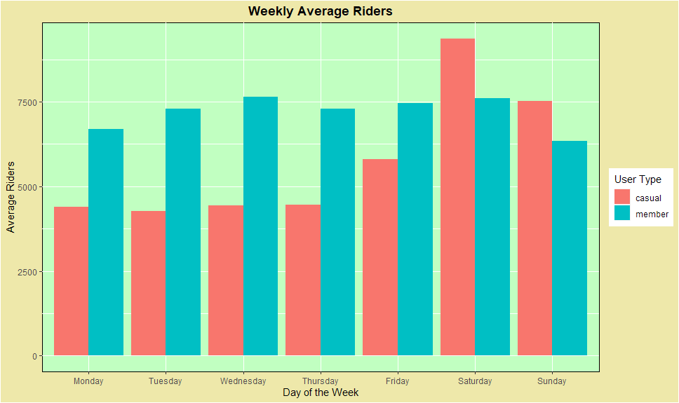
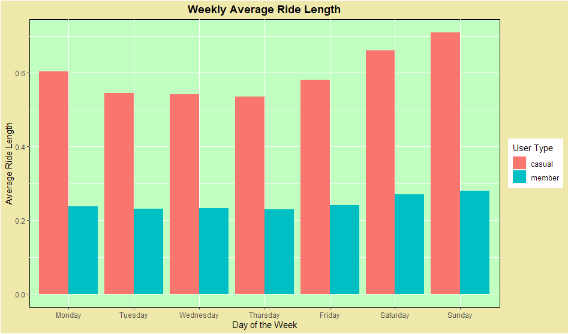
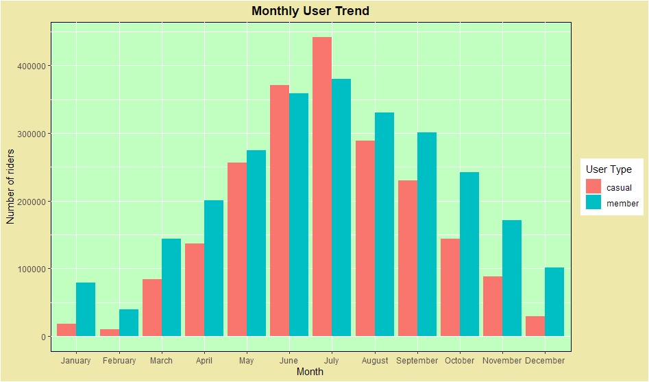

Cyclistic Bike Share Analysis: A Case Study
============================================

Ananth P 

11/09/2021

## Introduction 
This case study is a part of the 'Google Data Analytics Professional Certificate' offered by Coursera.

- **Scenario:** I am a junior data analyst working in the marketing analyst team at Cyclistic,a bike-share company in Chicago. The team wants to understand how casual riders and annual members use Cyclistic bikes differently.From these insights,my team will design a new marketing strategy to convert casual riders into annual members.
- **Business Task:** Understand how casual riders and members use Cyclistic Bikes and provide 3 strategies at converting casual riders to annual members.

## Data Preparation and Processing

We were provided with Cyclistic trip data for the past 12 months by Cyclistic. The data cleaning,subsetting,analysis and visualization were all done on Rstudio. We combined all the monthly data into a single data frame.

```
#Loading libraries.
library(tidyverse)
library(janitor)
library(lubridate)
library(dplyr)
library(lubridate)

#Read all the csv files into a dataframe
t1<-read.csv("t1.csv")
t2<-read.csv("t2.csv")
t3<-read.csv("t3.csv")
t4<-read.csv("t4.csv")
t5<-read.csv("t5.csv")
t6<-read.csv("t6.csv")
t7<-read.csv("t7.csv")
t8<-read.csv("t8.csv")
t9<-read.csv("t9.csv")
t10<-read.csv("t10.csv")
t11<-read.csv("t11.csv")
t12<-read.csv("t12.csv")

#Bind all the dataframes into one single dataframe
df<-rbind(t1,t2,t3,t4,t5,t6,t7,t8,t9,t10,t11,t12)
head(df)
```

This is how the data looked initially.


               ride_id rideable_type          started_at            ended_at            start_station_name start_station_id         end_station_name end_station_id start_lat start_lng
    1 322BD23D287743ED   docked_bike 2020-08-20 18:08:14 2020-08-20 18:17:51 Lake Shore Dr & Diversey Pkwy              329   Clark St & Lincoln Ave            141  41.93259 -87.63643
    2 2A3AEF1AB9054D8B electric_bike 2020-08-27 18:46:04 2020-08-27 19:54:51        Michigan Ave & 14th St              168   Michigan Ave & 14th St            168  41.86438 -87.62368
    3 67DC1D133E8B5816 electric_bike 2020-08-26 19:44:14 2020-08-26 21:53:07     Columbus Dr & Randolph St              195   State St & Randolph St             44  41.88464 -87.61955
    4 C79FBBD412E578A7 electric_bike 2020-08-27 12:05:41 2020-08-27 12:53:45            Daley Center Plaza               81     State St & Kinzie St             47  41.88409 -87.62964
    5 13814D3D661ECADB electric_bike 2020-08-27 16:49:02 2020-08-27 16:59:49      Leavitt St & Division St              658 Leavitt St & Division St            658  41.90299 -87.68377
    6 56349A5A42F0AE51 electric_bike 2020-08-27 17:26:23 2020-08-27 18:07:50      Leavitt St & Division St              658 Leavitt St & Division St            658  41.90302 -87.68373
       end_lat   end_lng member_casual
    1 41.91569 -87.63460        member
    2 41.86422 -87.62344        casual
    3 41.88497 -87.62757        casual
    4 41.88958 -87.62754        casual
    5 41.90300 -87.68384        casual
    6 41.90309 -87.68363        casual

The data was already complete,accurate and credible since it was Cyclistic who collected and provided it to us. The data cleaning was simple as well. 

- We changed the Date time into the correct format. 
- Some of the ride durations were negative or zero and upon consulting the Cyclistic's team we removed those observations.
- Variables not necessary for our analysis were filtered out.
- Additional variables were created to help with our analysis. 
  1. *weekday* denoting the day of the week for an entry.
  2. *ride_length* the duration of the ride 
  3. *month* the month of the year for an entry

``` 
#Changing to correct Format
df$started_at<-as_datetime(df$started_at)
df$weekday<-weekdays(df$started_at)
df$ended_at<-as_datetime(df$ended_at)

#Finding Ride Length
df$ride_length<-as.numeric(difftime(df$ended_at,df$started_at,units=c("hours")))
df$month<-month(df$started_at)

#Filter the variables necessary for our analysis and durations>0.
df1<-df %>%subset(df$ride_length>0,select=-c(ride_id,start_station_name,rideable_type,ended_at,start_lat,start_lng,end_lat,end_lng,start_station_id,end_station_name,end_station_id))

#Then drop rows having one or more 'NA'
df2<-drop_na(df1)         
summary(df2)

#New Variable weeks_ created
weeks_ <-as.numeric(difftime(max(df2$started_at),min(df2$started_at),units="weeks"))
```

## Analysis & Visualization

We sought the variation of riders throughout the week,year and the variation of ride length through the week to find some patterns that would distinguish the casual riders and annual members.

##### Histogram for Weekly Average Riders
``` 
##Average Riders Vs Day of the Week
df2 %>% group_by(weekday,member_casual)%>% summarise(avg_riders=(n()/weeks_)) %>% 
  ggplot(.,aes(x=weekday,y=avg_riders,fill=member_casual))+geom_bar(position="dodge",stat="identity")+
  labs(title="Weekly Average Riders",x="Day of the Week",y="Average Riders",fill="User Type")+
  theme(plot.title=element_text(hjust=0.5,face="bold"))+
  theme(panel.background=element_rect(fill="darkseagreen1",colour="black"),plot.background=element_rect(fill="palegoldenrod"))
```



##### Weekly Usage Patterns
```
##Mean Ride Length vs Day of the Week
df2 %>% group_by(weekday,member_casual)%>% summarise(mean_ride_length=mean(ride_length)) %>%
  ggplot(.,aes(x=weekday,y=mean_ride_length,fill=member_casual))+geom_histogram(position="dodge",stat="identity")+
    labs(title="Weekly Average Ride Length",x="Day of the Week",y="Average Ride Length",fill="User Type")+
    theme(plot.title=element_text(hjust=0.5,face="bold"))+
    theme(panel.background=element_rect(fill="darkseagreen1",colour="black"),plot.background=element_rect(fill="palegoldenrod"))
```



##### Monthly Usage Patterns
``` 
#Number of Riders Vs Month
ggplot(df2,aes(x=month,fill=member_casual))+geom_bar(position="dodge")+
  labs(title="Monthly User Trend",x="Month",y="Number of riders",fill="User Type")+
  theme(panel.background=element_rect(fill="darkseagreen1",colour="black"),plot.background=element_rect(fill="palegoldenrod"))+
  theme(plot.title=element_text(hjust=0.5,face="bold",colour="grey3"))+
  scale_y_continuous(labels=function(x) format(x,scientific=FALSE))
```



### Analysis Summary:
The following observations are made from our analysis.

- Throughout the week there is very less change in the average number of member riders.However the average number of casual riders increases significantly during weekends,peaking on Saturdays.
- At any given weekday,the average number of member riders is always more than the casual riders.
- At any given day of the week,the average ride length of casual riders is almost double that of members.
- There is an increase in the users who use Cyclistic's bikes from March,peaking at July and then decreasing towards the end of the year. Cyclistic's Bikes are least used by both members and casual riders in February. 
- Only during June and July,the number of casual riders is more than the number of members.

## Recommendations
Here are the top 3 recommendation to turn more casual riders to annual members.

- Creating a special weekly membership that can be converted to annual membership to unlock additional services. 
- Membership should include discounts for higher ride durations for the new members.
- Introducing a *Back-to-School* discount sale on membership during June and July that is not exclusive to just students.
